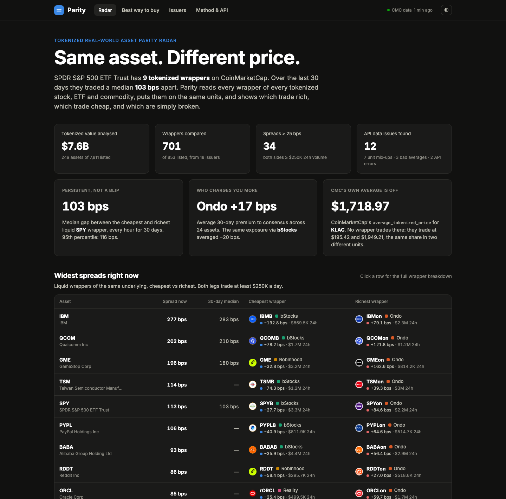
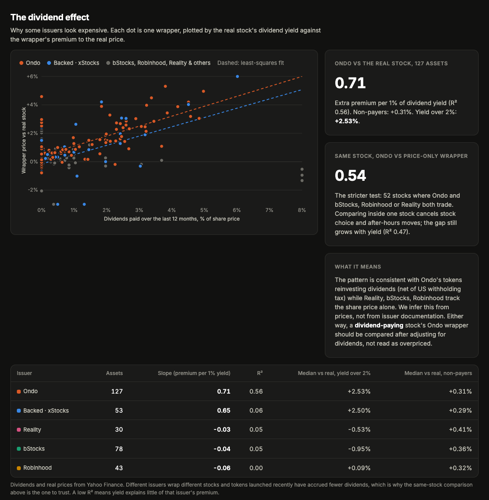
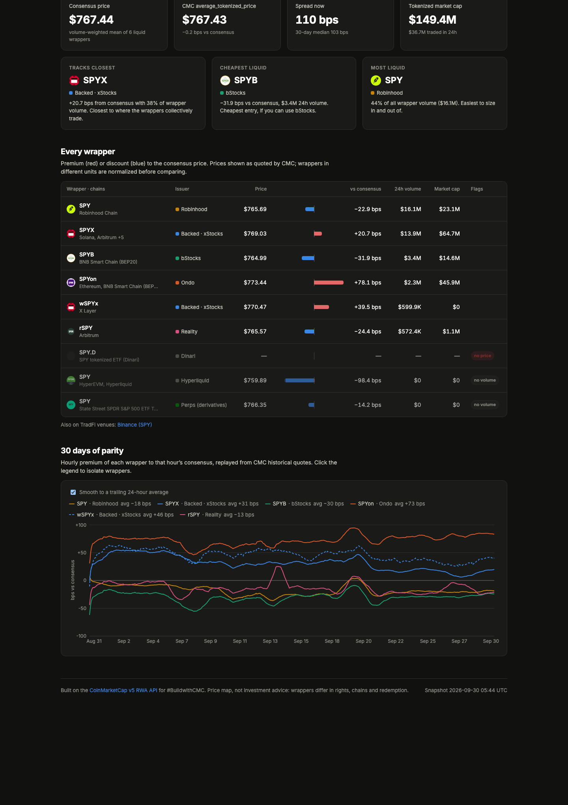
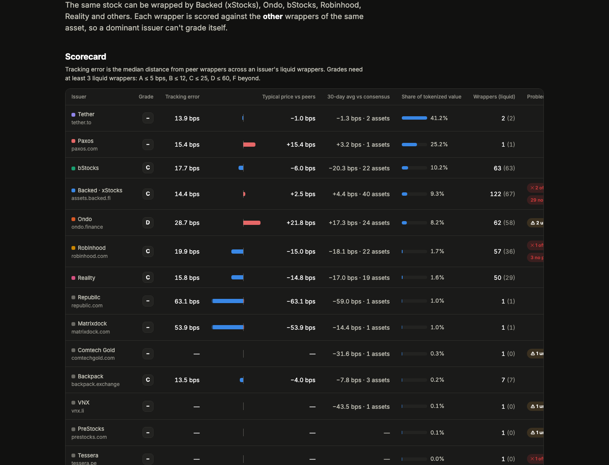
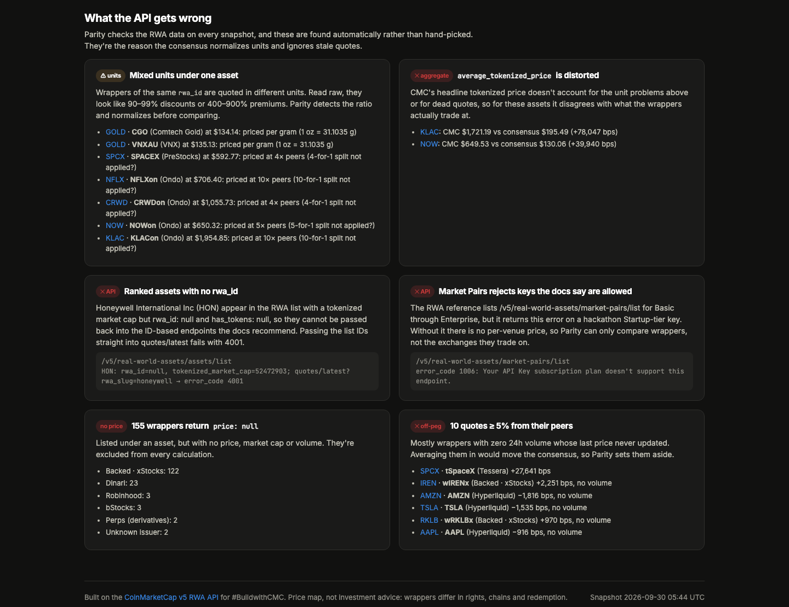

# Parity

**Same asset. Different price.** A parity radar for tokenized real-world assets, built on the CoinMarketCap v5 RWA API.

The S&P 500 has nine tokenized wrappers on CoinMarketCap: xStocks, Ondo, bStocks, Robinhood, Reality and more. They're meant to be the same thing, but for the last 30 days they've traded a **median 103 bps apart**, every hour. Parity reads every wrapper of every tokenized stock, ETF and commodity, puts them on the same units, checks them against the real listed stock, and shows which trade rich, which trade cheap, which are simply broken, and why.

**Track:** Real World Assets  
**Live demo:** https://sanchay117.github.io/parity/  
**Demo video:** https://youtu.be/Uz0YfScKXyg (2:38, narrated; also at https://sanchay117.github.io/parity/demo.mp4)



## What it found

From snapshots taken on 2026-09-30, plus 30 days of hourly history. The live site recomputes everything on each refresh, so its exact numbers will have moved.

| Finding | Evidence |
|---|---|
| **Spreads between wrappers of the same asset persist.** They aren't blips. | SPY wrappers: 30-day median spread 103 bps (p95 116). IBM 283 bps, QCOM 210, GME 180. |
| **The issuer decides what you pay, and dividends explain most of it.** | Ondo wrappers averaged **+17 bps** over consensus across 24 assets; bStocks **−20 bps**, Robinhood −18, Reality −17. Against the real stock, Ondo's premium rises with the stock's dividend yield: **slope ≈0.7, correlation ≈0.75 across 127 assets** (+0.3% for non-payers, +2.5% above a 2% yield). xStocks shows the same drift (≈0.65); bStocks, Robinhood and Reality stay flat. A slope near 0.7 is what reinvesting dividends after a 30% US withholding tax would produce: those wrappers behave like total-return tokens, so their "premium" is mostly accrued dividends, not overpricing. |
| **CMC's own `average_tokenized_price` blends units.** | KLAC: CMC reports **about $1,720 to $1,745**, **roughly 9× the real NASDAQ price** (~$197). Its wrappers trade near $195 (Backed, perp) and $1,960 (Ondo, quoted per 10 shares), so no wrapper trades anywhere near the average. NOW: CMC's average has ranged **4.4× to 5× the real NYSE price** (~$130) as its weights shift. |
| **Wrappers under one `rwa_id` use different units, and nothing in the API says so.** | Comtech CGO and VNX VNXAU are priced per gram, PAXG/XAUt per ounce. Ondo's NFLXon and KLACon (10×), NOWon (5×) and CRWDon (4×) trade at exact multiples of three or more independent peers, so one token stands for several shares (most likely after a split). |
| **Lots of dead data.** | 155 of 853 wrappers return `price: null` (122 of them Backed). 10 quotes sit ≥5% from their peers with zero volume. |

## What you can do with it

- **Radar** (`#/`): the widest spreads right now between liquid wrappers of the same asset (both legs ≥ $250K/day), the 30-day issuer premium table, and the automatically detected API data issues.
- **Best way to buy** (`#/asset/spy`): pick any of 249 assets and see every wrapper's premium or discount to consensus, volume, market cap, chains and flags. Three picks answer "which one should I buy?": tracks closest, cheapest liquid, most liquid. The 30-day hourly chart shows whether a gap is persistent or noise.
- **Tokenized vs the real stock** (on the radar): each asset's wrapper consensus against the listed stock or ETF itself, with CMC's average flagged where it's off by a multiple. Unit normalizations are confirmed against the real price.
- **The dividend effect** (`#/dividends`): every wrapper plotted by the real stock's dividend yield against its premium to the real price, with a fit per issuer. It separates total-return wrappers from price-only ones.
- **Issuers** (`#/issuers`): a league table grading each issuer on tracking error against its *peers* (leave-one-out, so the biggest wrapper can't grade itself), plus typical premium, market share and problem counts. Grades measure price tracking only, not custody or solvency.
- **Method & API** (`#/method`): how the numbers are computed, every endpoint called with credits used, and API feedback.



| Best way to buy SPY | Issuer scorecard |
|---|---|
|  |  |



## CoinMarketCap endpoints used

| Endpoint | Used for | Tier |
|---|---|---|
| `GET /v5/real-world-assets/assets/list` | Top 250 tokenized assets by tokenized market cap | Basic |
| `GET /v5/real-world-assets/quotes/latest` | Every wrapper per asset: issuer, price, market cap, 24h volume, `crypto_id` | Basic |
| `GET /v5/real-world-assets/info` | Descriptions, industry, primary exchange | Basic |
| `GET /v5/real-world-assets/issuers/list` | Issuer names, websites, token counts | Basic |
| `GET /v5/real-world-assets/map` | Universe size per asset type (0 credits) | Basic |
| `GET /v5/real-world-assets/market-pairs/list` | Probed on every snapshot; returns 1006 on our key (see feedback) | Basic per docs |
| `GET /v2/cryptocurrency/info` | Wrapper logos and chains, joined on `crypto_id` | Basic |
| `GET /v1/global-metrics/quotes/latest` | Market context | Basic |
| `GET /v2/cryptocurrency/quotes/historical` | 30 days × hourly prices for every liquid wrapper of 24 assets (one-off backfill) | Paid (our hackathon key) |

**External reference (not CMC):** Yahoo Finance's public chart endpoint supplies the real stock's last regular-session price and 12-month dividends, because CMC has no quote for the listed instrument behind a wrapper. About 245 calls per snapshot, no key; a quote more than 30% from the wrapper consensus is dropped as a different instrument sharing the ticker, and a failed fetch keeps the previous value.

A cold snapshot is **25 calls / 17 credits**. Refreshes reuse cached token metadata: **17 calls / 9 credits**. The one-off backfill was 24 calls / 1,046 credits.

### Evidence of real calls

Every snapshot writes the exact request (key redacted) and a trimmed response for each endpoint to [`evidence/`](evidence). For example, [`evidence/rwa-quotes-latest.json`](evidence/rwa-quotes-latest.json):

```jsonc
{
  "request": "GET https://pro-api.coinmarketcap.com/v5/real-world-assets/quotes/latest?rwa_id=1%2C115%2C9%2C…",
  "headers": { "X-CMC_PRO_API_KEY": "<redacted>" },
  "response": {
    "data": {
      "rwa_assets": [{
        "name": "Gold", "symbol": "GOLD", "rwa_id": 1, "asset_type": "commodity",
        "average_tokenized_price": 4181.3, "tokenized_market_cap": 4898392746,
        "tokens": [
          { "symbol": "PAXG", "price": 4185.84, "issuer_name": "Paxos", "crypto_id": 4705, … },
          …
```

The site also shows every call from the latest snapshot (endpoint, calls, credits, errors) on the Method & API page, and [`public/data/snapshot.json`](public/data/snapshot.json) keeps the full log in `calls`.

To reproduce by hand:

```bash
curl -H "X-CMC_PRO_API_KEY: $CMC_API_KEY" \
  "https://pro-api.coinmarketcap.com/v5/real-world-assets/quotes/latest?symbol=SPY"
```

## How the numbers work

1. **Group.** `quotes/latest` returns every wrapper under its underlying asset, with issuer and `crypto_id`.
2. **Fix units.** A median price sets a reference. A wrapper that sits a known ratio away (31.1035× for grams of gold, 32.15× for kilograms, 2 to 100× for multi-share or fractional tokens) is flagged and normalized. The assumption is that the unit most wrappers use is the reference; every normalization is flagged in the UI, so you can check each one.
3. **Discard what can't be trusted.** No price, no volume, or under $50K/day of volume: the wrapper doesn't vote. After unit fixes, anything ≥5% from the median is off-peg (usually a stale last trade) and excluded.
4. **Consensus** is the volume-weighted mean of what's left. Each wrapper's premium or discount is measured against it in bps. Issuer grades use a **leave-one-out** consensus, so a dominant wrapper can't grade itself.
5. **The real stock.** Each wrapper and CMC's own average are compared with the listed instrument's last price, which also confirms each unit normalization. Premium is then regressed on 12-month dividend yield per issuer to separate total-return wrappers from price-only ones.
6. **History.** The same calculation is replayed on every hour of the backfill. Each new snapshot appends a point, so the charts keep moving on the free tier.

All of this lives in one pure, unit-tested module: [`src/lib/parity.ts`](src/lib/parity.ts), with 20 tests in [`src/lib/parity.test.ts`](src/lib/parity.test.ts).

**Spreads are a price map, not an arbitrage guarantee.** Wrappers differ in chain, KYC, redemption rights and trading hours.

## API feedback: what the API made possible, and where it got in the way

**Made possible.** `quotes/latest` already groups every wrapper under its underlying and names the issuer. Doing this by hand would mean maintaining a mapping of hundreds of tickers across a dozen issuers. Each wrapper also carries a `crypto_id`, so the rest of the CMC API (logos, chains, hourly history) works on RWA wrappers with no extra glue. That join is what made the 30-day history and the chain column possible.

**Got in the way.**

1. **Mixed units under one `rwa_id`.** Per-gram and per-ounce gold share an asset, and some stock wrappers stand for several shares per token. No field says so. `average_tokenized_price` is computed across them, so for KLAC it lands on $1,719 when the wrappers trade at $195 and $1,955. A per-token `units_per_share` field would fix both.
2. **`market-pairs/list` returns `1006`** ("plan doesn't support this endpoint") on our hackathon API key, although the docs list it for every plan from Basic up. (Other teams report it working on the Startup tier, so this is at least a doc/plan mismatch.) Without it there's no per-venue view.
3. **Ranked assets with `rwa_id: null`.** An ID list taken straight from `assets/list` can contain `null` (Honeywell has `rwa_id: null` and `has_tokens: null` despite a $52M tokenized cap), which fails the whole `quotes/latest` request with `4001`. Fetching it by `rwa_slug=honeywell` also returns `4001`.
4. **Nulls.** Whole groups of wrappers return `price: null` (122 Backed, 23 Dinari), and some tokens have `issuer_name: null`.
5. **No RWA history endpoint.** History has to be rebuilt per wrapper from `/v2/cryptocurrency/quotes/historical`, which the free tier doesn't include.
6. **Symbol collisions.** `/v2/tools/price-conversion?symbol=XAU` returns memecoins alongside gold, so IDs are the only safe join key.

## Run it

Requires Node 22.18+ (runs TypeScript scripts natively).

```bash
cp .env.example .env        # add your CMC_API_KEY
npm install
npm run snapshot            # 9 to 17 credits: writes public/data/snapshot.json + evidence/
npm run backfill            # optional, needs a paid tier: 30 days of hourly history
npm run dev                 # http://localhost:5173
npm test                    # analytics unit tests
```

The committed snapshot means `npm install && npm run dev` works without a key.

### Architecture

```
scripts/snapshot.ts ──► CMC API (Basic-tier endpoints) ──► public/data/snapshot.json, evidence/*.json
scripts/reference.ts ──► real stock price + dividends (Yahoo Finance, external) ──► snapshot.json (asset.reference)
scripts/backfill.ts ──► /v2/cryptocurrency/quotes/historical ──► public/data/history/<rwa_id>.json
src/lib/parity.ts   ──► pure analytics (units, consensus, spreads, issuers, real-price gaps, dividend fits, history)
src/                ──► React + Vite static site, reads public/data/*
.github/workflows/  ──► every 3h: snapshot (if the key secret is set) → test → build → GitHub Pages
```

It's a static site on purpose. The API key never reaches the browser, the demo keeps working if the CMC call fails (the last good snapshot stays live), and the RWA endpoints it refreshes from are all on the free tier, so it survives the end of the hackathon's upgraded access.

## License

MIT
